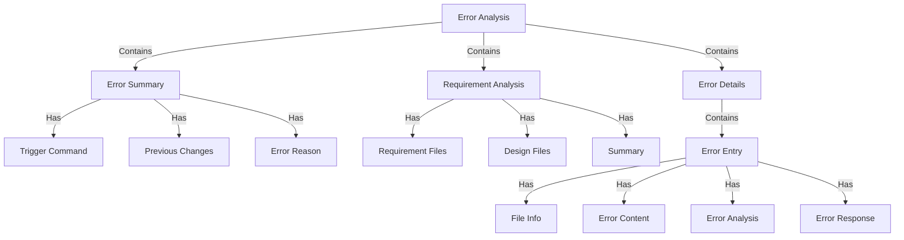
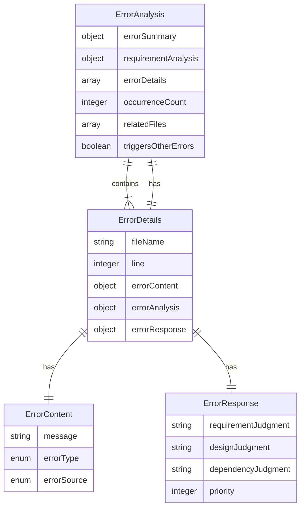
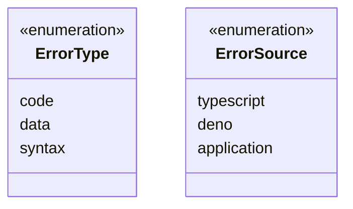
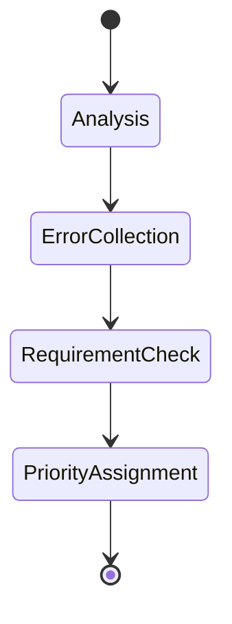
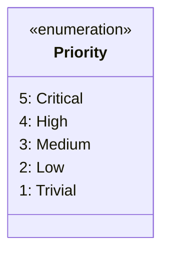

# エラー分析スキーマ

## 概要

## 構造

## エラータイプ

## エラー分析の状態

## 属性

### エラーコンテンツ
- **message**: 実際のエラーメッセージテキスト
- **errorType**: 
  - `code`: ロジックまたは実装エラー
  - `data`: データ構造またはフォーマットエラー
  - `syntax`: 言語構文エラー
- **errorSource**:
  - `typescript`: TypeScriptコンパイラエラー
  - `deno`: Denoランタイムエラー
  - `application`: アプリケーション固有のエラー

### エラー分析
- **occurrenceCount**: このエラーが発生した合計回数
- **relatedFiles**: エラーチェーンに関連するファイルのリスト
- **triggersOtherErrors**: このエラーが他のカスケードエラーを引き起こすかどうか

### エラー対応
- **requirementJudgment**: コードを修正するか要件を更新するかの判断
- **designJudgment**: コードを修正するか設計を更新するかの判断
- **dependencyJudgment**: このエラーを直接修正するか依存関係を先に対処するかの判断
- **priority**: 整数の優先順位ランキング（1-5）
  - `5（重大）`: システム操作をブロックするかデータ破損を引き起こす
  - `4（高）`: コア機能に深刻な影響を与える
  - `3（中）`: 重要でない機能に影響するか回避策がある
  - `2（低）`: 影響が最小限の軽微な問題
  - `1（些細）`: 見た目の問題や機能強化要求

