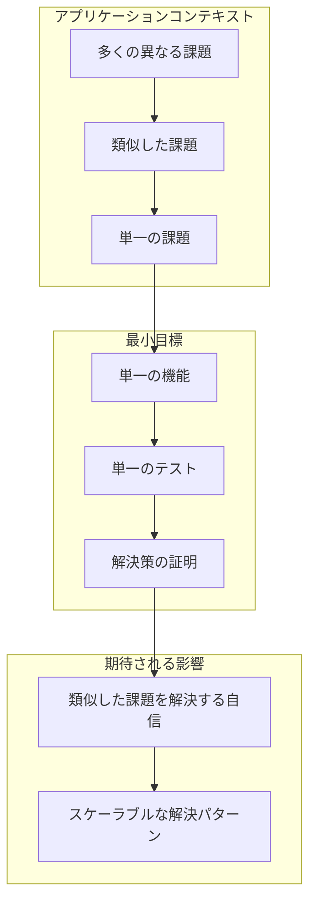
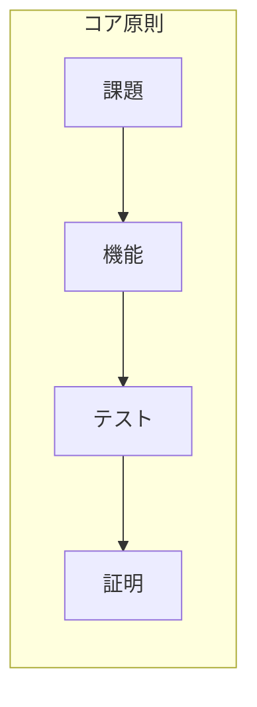

# 最小目標スキーマ

## 定義
最小目標は、「このテストが合格すれば、同様の課題をクリアできる」ことを示す最小の機能単位を表します。特定のタイプの問題を解決するための概念実証として機能します。

## 詳細説明
ソフトウェア開発ですべての問題を同時に解決することは不可能です。したがって、各課題に対する解決策が機能することを証明する特定の範囲を定義する必要があります。

最小目標の概念は、以下の間に1対1の関係を確立します：
- 1つの課題と1つの機能
- 1つの機能と1つのテスト

このテストが合格すると、最小目標が達成されたと見なします。

## 例
たとえば、標準ライブラリのインポートを実装する場合、特定のコンポーネントでインポート機能を正常に実装してテストできれば、アプリケーション全体で同様のインポート要件を処理できることの証明になります。

## 概念の視覚化

## 利点
1. **集中した開発**
   - 明確な範囲定義
   - 管理可能な実装単位
   - 検証可能な成功基準

2. **スケーラブルなソリューション**
   - 類似した課題に対する実証済みパターン
   - 再利用可能な実装アプローチ
   - 一貫した問題解決方法

3. **効率的な進捗**
   - 段階的な進歩
   - 測定可能な成果
   - 明確な検証ポイント

## 実装戦略
1. より大きな問題空間内の特定の課題を特定する
2. この課題に対処する最小限の機能を定義する
3. 機能を検証する集中したテストを作成する
4. 成功した実装を類似した課題のパターンとして使用する

## 結論
最小目標アプローチは、複雑な問題を証明可能で管理可能な単位に分解することで、構造化された方法を提供します。この方法論は、ソリューションの品質とスケーラビリティを維持しながら、着実な進歩を確保します。 