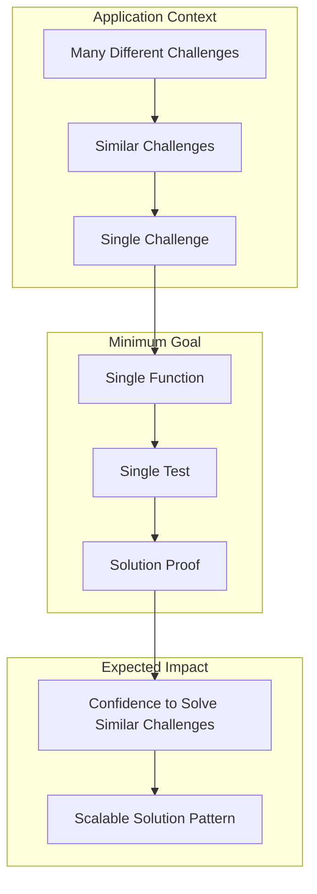
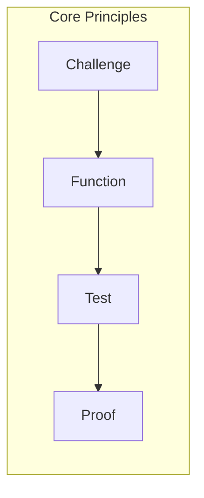

# Minimum Goal Schema

## Definition
A minimum goal represents the smallest functional unit that demonstrates "if this test passes, similar challenges can be cleared." It serves as a proof of concept for solving a specific type of problem.

## Detailed Explanation
In software development, it's impossible to solve all problems simultaneously. Therefore, we need to define a specific scope that proves a solution works for each challenge.

The minimum goal concept establishes a one-to-one relationship between:
- One challenge and one function
- One function and one test

When this test passes, we consider the minimum goal achieved.

## Example
For instance, when implementing standard library imports, successfully implementing and testing the import functionality in a specific component serves as proof that similar import requirements can be handled throughout the application.

## Concept Visualization

## Benefits
1. **Focused Development**
   - Clear scope definition
   - Manageable implementation units
   - Verifiable success criteria

2. **Scalable Solutions**
   - Proven patterns for similar challenges
   - Reusable implementation approaches
   - Consistent problem-solving methods

3. **Efficient Progress**
   - Incremental advancement
   - Measurable outcomes
   - Clear verification points

## Implementation Strategy
1. Identify a specific challenge within a larger problem space
2. Define the minimum functionality to address this challenge
3. Create focused tests to verify the functionality
4. Use successful implementation as a pattern for similar challenges

## Conclusion
The minimum goal approach provides a structured method by breaking down complex problems into provable, manageable units. This methodology ensures steady progress while maintaining solution quality and scalability. 