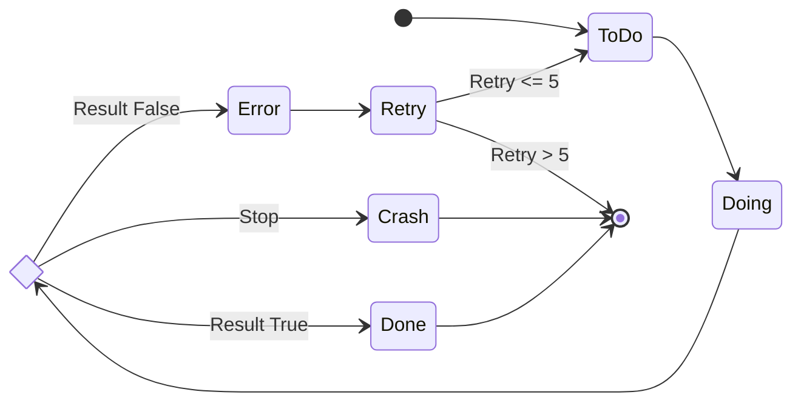

# 状態遷移スキーマ

## タスクと処理の状態遷移

## 状態の説明

### ToDo
- 初期状態
- タスクが定義されているが、まだ開始されていない

### Doing
- 実行中の状態
- タスクが現在処理されている

### Result
- 判定ポイント
- 実行結果に基づいて次の状態を決定

### Done
- 正常終了
- タスクが成功裏に完了

### Error
- エラー状態
- タスクの実行中にエラーが発生

### Crash
- 致命的エラー
- 回復不能な状態でプロセスが停止

### Retry
- 再試行状態
- エラー後に再度タスクを実行 