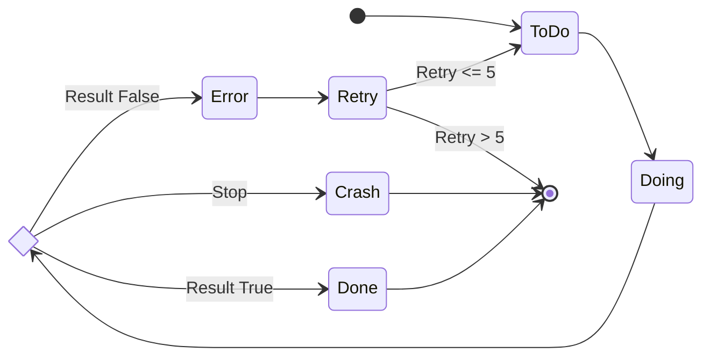

# State Transition Schema

## Task and Process State Transitions

## State Descriptions

### ToDo
- Initial state
- Task is defined but not yet started

### Doing
- Execution state
- Task is currently being processed

### Result
- Decision point
- Determines next state based on execution result

### Done
- Normal completion
- Task completed successfully

### Error
- Error state
- Error occurred during task execution

### Crash
- Fatal error
- Process stopped in an unrecoverable state

### Retry
- Retry state
- Re-execute task after error 