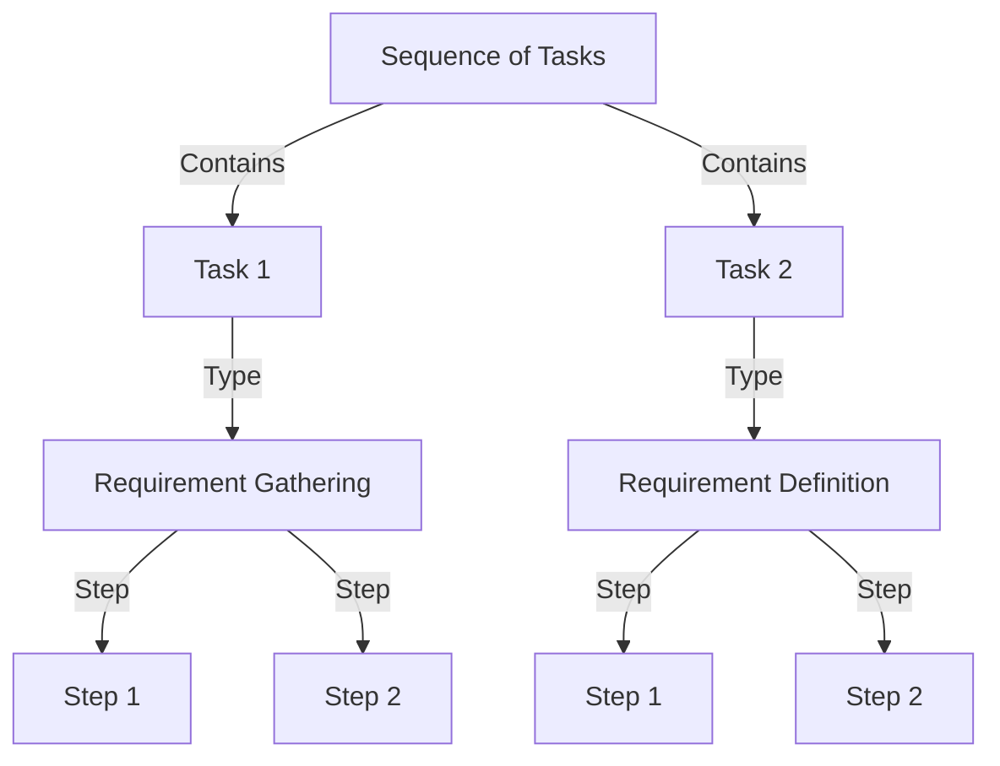
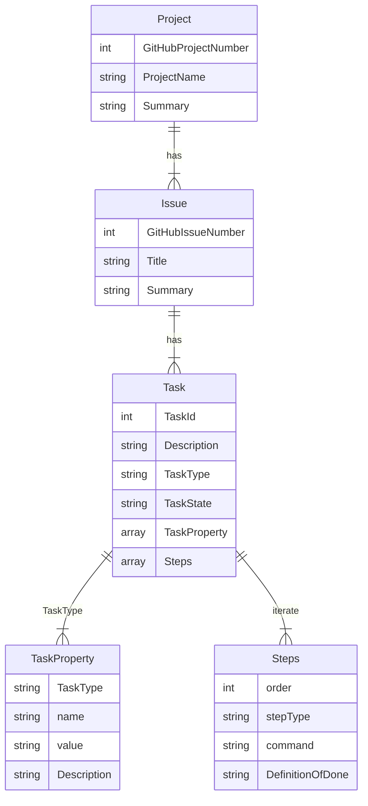
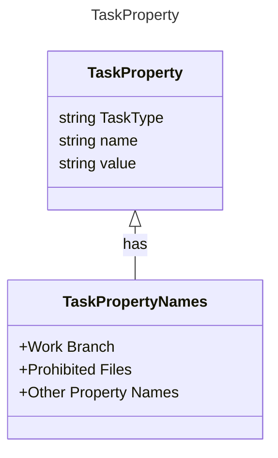
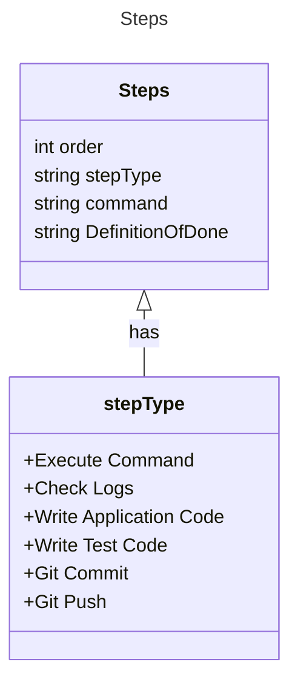

# プロジェクト構造スキーマ

## 概要

```mermaid
graph TD
  A[Sequence of Tasks] -->|Contains| B[Task 1]
  A -->|Contains| C[Task 2]

  B -->|Type| D[Requirement Gathering]
  C -->|Type| E[Requirement Definition]

  D -->|Step| D1[Step 1]
  D -->|Step| D2[Step 2]

  E -->|Step| E1[Step 1]
  E -->|Step| E2[Step 2]
```

## プロジェクト分解構造

```mermaid
erDiagram
  Project ||--|{ Issue : has
  Project {
    int GitHubProjectNumber
    string ProjectName
    string Summary
  }
  Issue ||--|{ Task : has
  Issue {
    int GitHubIssueNumber
    string Title
    string Summary
  }
  Task {
    int TaskId
    string Description
    string TaskType
    string TaskState
    array TaskProperty
    array Steps
  }
  Task ||--|{ TaskProperty : TaskType
  Task ||--|{ Steps : iterate
  TaskProperty {
    string TaskType
    string name
    string value
    string Description
  }
  Steps {
    int order
    string stepType
    string command
    string DefinitionOfDone
  }
```

## 属性
### TaskProperties

```mermaid
---
title: TaskProperty
---
classDiagram
  class TaskProperty {
    string TaskType
    string name
    string value
  }

  %% TaskProperty.name can take the following enumeration values. see definitions for more names
  class TaskPropertyNames {
      +Work Branch
      +Prohibited Files
      +Other Property Names
  }  

  %% Relationship between TaskProperty and TaskPropertyNames
  TaskProperty <|-- TaskPropertyNames : has
```

### Steps

```mermaid
---
title: Steps
---
classDiagram
  class Steps {
    int order
    string stepType
    string command
    string DefinitionOfDone
  }

  %% stepType can take the following enumeration values. see definitions for more types
  class stepType {
      +Execute Command
      +Check Logs
      +Write Application Code
      +Write Test Code
      +Git Commit
      +Git Push
  }  

  %% Relationship between Steps and stepType
  Steps <|-- stepType : has
``` 